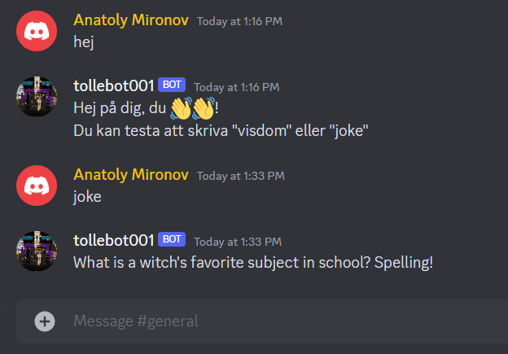

# My first Discord Bot

The bot responds to messages:

* On "Hej" it greets and tells what you can do with it
* On "Visdom" it presents a word of wisdom
* On "Mat" it suggests a dish
* On "GPT <question>" it fetches an answer from ChatGPT (3.5)



## Discord Bot Setup

Create a new app and a bot in Discord Developer Portal, set up permissions and intents. Get a token.

Create a `.env` file and paste your tokens here:

```
DISCORD_TOKEN=<YOUR-TOKEN>
OPENAI_API_KEY=<YOUR_KEY>
OPENAI_API_BASE=<OPENAI URI>
```

## Installation and requirements

### Python Virtual Environment

Python 3.9 and higher is requireed, get the code, create a virtual environment and install the pip packages

```bash
python -m venv tdb001-venv
pip install -r requirements.txt
```

(If required, you might need to install venv: `sudo apt install python3-venv -y`).

In Visual Studio Code the virtual environment will be loaded automatically, so just press F5.

If in terminal, activate the virtual environment

```powershell
.\tdb001-venv\Scripts\activate.ps1
```

```bash
source tdb001-venv\bin\activate
```
## Running the bot locally

To start the bot from terminal run:

```bash
python bot.py
```

If you want to start it from SSH and log out, run the following:

```bash
nohup python bot.py &
```

### Running the bot in a Docker container

There are two options: 

Option 1: Docker build and run

```bash
docker build -t tollediscordbot001 .
docker run -d --name tollebot001 tollediscordbot001:latest
```

Option 2: Docker Compose

```bash
docker compose up -d --build
```

## Deploying to Azure

I suggest you to follow you this guide to prepare you Azure environment and Github repo and set up a container app and a workflow in Github Actions.

* [Quickstart: Build and deploy your container app from a repository in Azure Container Apps](https://learn.microsoft.com/en-us/azure/container-apps/quickstart-code-to-cloud?tabs=bash%2Ccsharp&pivots=github-build#prepare-the-github-repository)